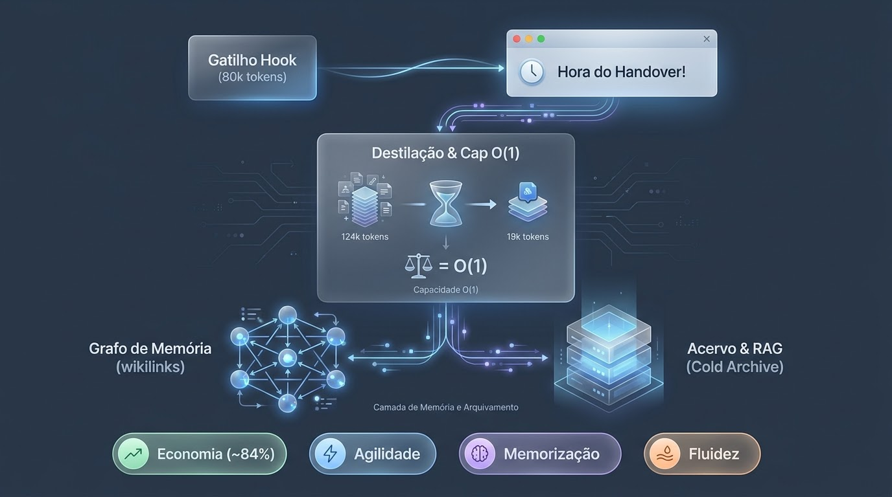
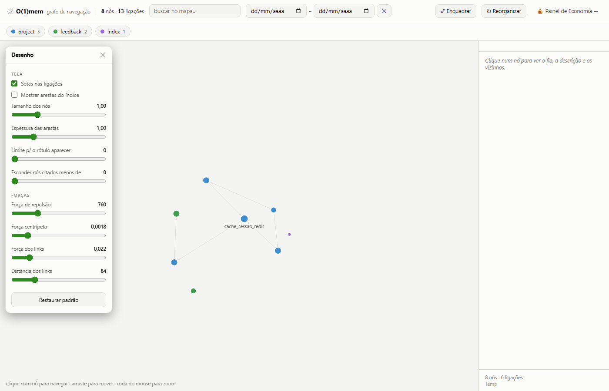

# 🪙 O(1)mem — Token Economy for Claude Code

Read this in other languages: [Português (Brasil)](./docs/README.ptbr.md)

### Every new session opened after `/clear` picks up the thread right from the index — without re-paying for a dragged conversation
🇧🇷 Made in Brazil

---


<p align="center">
  
</p>

<p align="center"><sub><b>O(1)mem</b> — the name is the thesis: <code>O(1)</code> (with the <em>cap</em>, memory grows in constant time) + <code>mem</code> (memory). Simple by design.</sub></p>

---

## ⚡ TL;DR

> **Context is expensive and finite. These skills stop the leak, clean up what already leaked, and traverse what's left when the index isn't enough.**

- `organizador-mem` — **slims down** a large context file (`CLAUDE.md`, memory) by separating what is always-relevant from what is on-demand.
- `handover` — **stanches** the loss of context when issuing `/clear`, distilling the session into 3 cost layers + a cap that prevents memory from inflating again.
- `retomar` — **resolves which project** to resume before reading any memory, for developers working on multiple active projects on the same machine.
- `lembrar` — **answers a question about the past** by querying the cold archive on demand, so "do you remember X?" stops being answered with "no" while the answer sits indexed one command away.
- `handover-nudge-hook` — **notifies the right time** to run `/handover`, measuring conversation growth turn-by-turn (with built-in value guardrails and a mute route).
- `graph` — **traverses by structure**: turns the `[[wikilinks]]` you already write into a navigable graph (CLI + page). It does not enter the boot sequence.
- `rag` — **traverses by meaning**: semantic search over the cold archive (`MEMORY_ARCHIVE.md`, handovers), for when nobody wrote a wikilink. Also stays out of the boot sequence.
- **npm installer** (`@tbluhm82/o1mem`) — packages Python + Node in a single command: detects the environment, indexes projects, and registers the hook.

👉 One does the cleanup. The other prevents re-soiling. The hook notifies at the right time. The graph and RAG traverse what's already written. Together, they close the loop.

---

## 🔥 The Pain (You Might Recognize)

Every Claude Code session pays a toll: re-reading project instruction files (`CLAUDE.md`, memory, handovers) — entirely, every single time, even when 90% of it doesn't touch today's task. I experienced this cycle in a real project, and these skills were born from it. Each attacks a slice of the problem; specific pain points are detailed in their respective sections.

> ⚠️ **Regarding percentages:** the numbers below represent **real cases I observed**, not a promise. Your mileage depends on file size and how much of it is "always-relevant" vs. "on-demand". Treat them as orders of magnitude.

> 🌐 **Domain-agnostic.** Born in a real project of mine, but the mechanics apply to any repository with a context file that grew too large or a memory that needs to survive `/clear`. Examples inside each `SKILL.md` are just that — examples.

---

## 🧹 `organizador-mem`

**The Pain.** My `CLAUDE.md` was over 1,500 lines long. Every session read all of it — even when 90% had nothing to do with the day's task. I was paying, every turn, for subsystem rules I wasn't even going to touch.

**What it does.** Splits the large file into an **always-relevant core** + **on-demand satellite documents**, connected by a lean *map*. The cut for each segment is decided by an **agent that reads and understands the semantics** — not a blind regex or heading split. When two passages appear tightly coupled, or a section fits into two topics, the skill **pauses and asks** before applying. I learned the hard way that mechanical splits fragment reasoning right down the middle.

**Why it improves things.** The model shifts to reading the short core + the map, and only opens the satellite document that the task actually touches. The reading cost drops from "the entire file" to "core + what matters right now."

**Real Results.**

| Before | After | Reduction |
|---|---|---|
| `CLAUDE.md` ~1,589 lines read/session | ~150 core lines + map | **~90%** |

Typical expected range: **60–90%**, when most of the file is topic-specific.

> ⚖️ **Treat this `~90%` as a ceiling, not an average — and here is the honest reason why.** This skill does not *erase* paid tokens (that is what `handover` does, below); it **defers** the cost: satellite docs are only read when a task touches them. The session gain equals `~90%` fully **only in sessions that open zero satellites**. When one is opened, you re-pay for that satellite, and real savings become `Σ(1−pᵢ)·satellite_costᵢ − map_cost`, where `pᵢ` is the rate at which each satellite is opened. **In my project, I measured `p≈0.50`** (about half the sessions open at least one rule satellite) — so the **average** sits materially below the ceiling. Two corollaries: if `p` is high, savings collapse (you almost always pay for the satellite anyway); if you slice too aggressively, the map's fixed cost eats up the savings — which is why the skill **asks before cutting**. What does **not** depend on `p` is *discoverability*: the map guarantees you always know a rule exists and where to find it. That is a **qualitative** gain (adherence), not just tokens — and honestly the more valuable half.

**Intuition in one sentence:** *not every rule is always relevant.* Non-negotiable principles belong in the core — every turn. A subsystem's law only matters when you modify it. The map preserves *discoverability* ("a rule about X exists, open doc Y") without paying for *content* until needed.

**What it manages in `.claude/`.** Resides in `.claude/skills/organizador-mem/SKILL.md`. **Reorganizes** your `.claude/CLAUDE.md` (or any file you point to) and creates a satellite folder alongside it (e.g., `documentation/rules/`). Does not touch source code — only the instruction layer loaded by Claude.

---

## 📤 `handover`

**The Pain.** Halfway through a task and facing a dilemma with no good exit: carry the entire conversation forward (prohibitively expensive) or run `/clear` and start over re-explaining everything (slow — and you ALWAYS forget a crucial reason along the way).

**What it does.** Prepares a **clean exit** for the session. Writes **one** selective document inside `documentation/` — selective is a strict rule, not an adjective: only what git + code + memory **cannot** tell on their own gets included (the *why* behind decisions including discarded alternatives, pending state, exact next step, risks). Updates a lean breadcrumb in memory and declares a **resume mode**: `fast` (next step doesn't touch runtime) or `verified` (touches it — forcing the new session to re-check live state before asserting anything).

**Why it improves things.** Distributes state across **3 different cost layers**:

| Layer | Loaded When | Cost |
|---|---|---|
| **Summary/Messages** | you resume *this* conversation | high — dies upon `/clear` |
| **Index-Memory** | **every** new session | low — lean pointing breadcrumb |
| **Handover-File** | only when explicitly opened | zero until opened |

Each piece of information sits in the cheapest layer that still delivers it on time.

**Real Results.** The biggest gain is **structural** — taught to me by a bug of my own creation. The 1st version preserved resume history indefinitely: every handover deposited a permanent line into the index, growing at **O(n)** without anyone noticing. This version introduces a **history cap** (at most the **2** previous resumes; the rest is delegated to durable pointers) → **O(1)** growth.

| Aspect | Without Cap | With Cap |
|---|---|---|
| Memory Index | 96 lines and rising | 65 lines, stable (**~32% reduction**) |
| Growth per Session | +1 permanent line (O(n)) | bounded (O(1)) |

Without the cap, the index would inflate again within weeks — I only realized it after looking at the context usage dashboard and wondering why memory weighed so much.

> **Why O(1), in a single breath.** The cap trades a **slope** for a **ceiling**. Without it, every handover leaves a line that never leaves — 10 sessions, 10 lines; 100 sessions, 100 lines: size = `f(number of sessions)`, growing **forever (O(n))**. With cap = 2, upon inserting a new entry, the oldest surplus entry is deleted — 10, 100, or 1000 sessions → **always 2 lines**. The variable `n` is removed from the formula: it's not "grows slowly," it's "does not grow" (**O(1)**). And this matters more than any other savings because this is the **only layer paid in every session, forever** — the worst place in the world for an accumulator to live.
>
> **The rigor demanded by the repo's name.** What is O(1) is the **RESUME history**, not the entire `MEMORY.md`: index-lines pointing to each `project_*.md` still grow by one per project. To be precise: **O(1) per session, O(p) per project** — which remains a strong claim, because sessions happen hundreds of times while new projects happen half a dozen times. That is why the precise statement is *"index growth **per session**"*, not access time.
>
> **What it cost: nothing.** Older RESUMEs didn't vanish — `HANDOVER_*.md` files in `documentation/` serve as the permanent record. The cap simply removed the copy from the expensive layer (index, paid always) and left it in the cheap layer (file, paid only when opened). It wasn't `organizador-mem` in disguise — it was moving from a loaded layer to a **deferred** one. Real savings, not accounting tricks.

**Intuition in one sentence:** *memory is the INDEX — point, don't repeat.* The layer loaded every session must be as lean as possible: it only needs to state **which file to open** and **what the next step is**. And because "what was true when I wrote it" ≠ "what is true now," `verified` mode exists for one reason: token savings are **never** worth making false claims about the runtime environment.

**What it manages in `.claude/`.** Resides in `.claude/skills/handover/SKILL.md`. **Writes** the handover to `documentation/` and **maintains** a lean, capped memory index (`MEMORY.md` + `memory/*.md`). It is memory's *ingestion* discipline; `organizador-mem` is the *cleanup*.

---

## 🧭 `retomar`

**The Pain.** Developers working across multiple active projects open sessions sometimes in one primary directory, sometimes in another. The `MEMORY.md` appearing alone in context is indexed by the **directory where the session was launched** — not by the intent of "what I want to resume." Result: "resume" pulls memory from the wrong project with complete confidence, because the correct content wasn't even in context to be chosen.

**What it does.** Resolves **which project** before reading memory, handovers, or code. Enumerates real projects (doesn't infer slugs via path transformations), cross-references against what the user named — and if unnamed with multiple projects holding resume breadcrumbs, it **asks**, never assuming the primary directory. Only after resolving the project does it hand over to **Step 4** of the `handover` skill, which determines *how* to resume (fast vs. verified mode).

**Why it exists.** It addresses a specific half of the problem: **which** project, not **how** to resume. It exists because resuming the wrong project is a recurring and costly error — asking a question takes seconds; resuming wrong wastes the entire session.

**What it manages in `.claude/`.** Resides in `.claude/skills/retomar/SKILL.md`. Writes nothing — only decides and delegates.

---

## 🔗 Why They Belong Together

`handover` **feeds** memory upon session exits; `organizador-mem` **reorganizes** it when it inflates; `retomar` ensures new sessions **load the right memory** before anything else. Without the first being disciplined (with the cap), the second becomes **a fool's errand** — every handover deposits another line, re-fattening the index you just slimmed down. Together: capped entry + agentic cleanup + project resolution.

---

## ⏰ `handover-nudge-hook` — *When* to Trigger

The skills above solve **how** to stanch and clean up. What was missing was **when** — and "when" is precisely what we forget in the middle of a good coding flow. This hook (`UserPromptSubmit`) measures **conversation growth** turn-by-turn and, upon crossing a threshold, **suggests** a `/handover`.

The metric it tracks is **not** the total window size — `system`, `tools`, `memory`, and `skills` are ~fixed; that's not what handover saves. It measures **`current_total − session_baseline`**: the cost of re-paying for the *conversation* by dragging it forward. That delta is what triggers the nudge.

<p align="center">
  
</p>

> Notifications arrive as a **native Windows toast** (`notify_windows`, zero dependencies, via PowerShell) — visible even when looking away from the terminal. Fail-open on Mac/Linux: no native toast yet, but never breaks a turn.

Two guardrails prevent it from becoming spam:

- **Value Guardrail.** It doesn't blindly say "run a handover" — it tells the model to *apply Step 0 first*. Disposable exploration without durable state receives *"memory is sufficient here"*, **never** an empty handover with a timestamp.
- **Mute Route.** The prompt uses `AskUserQuestion` offering *prepare / not now / **mute for this session***, without repeating across threshold tiers — the antidote to alert fatigue.

**Configurable** threshold (default 80k — `n=1`, order of magnitude), and every alert is logged so you can calibrate with **real data** over 10–15 sessions. Installation and details in [`handover-nudge-hook/`](handover-nudge-hook/).

**Optional RAG Enrichment (opt-in, disabled by default):** the hook can query a local daemon (`rag/o1mem_rag_daemon.py`) to attach the semantically closest excerpt to your current activity alongside the alert. Controlled via `rag_enrichment: false` in config — no unexpected behavior unless explicitly toggled on.

---

## 🕸️ `graph` — Traverse by Structure

The hot index (`MEMORY.md`) handles the boot process. But as the collection grows, you might have a question and need to **traverse** — "what else touches this rule?", "did this fact become an orphan?". `graph` answers this using the structure you already write: the `[[wikilinks]]` that `handover` teaches you to embed in every memory entry.

**Why it isn't RAG.** At boot, there is no query — only "resume." A retrieval approach would need to fetch something before a question exists, replacing a deterministic read with a probabilistic one that solves the same problem with a chance of error. The graph doesn't have this issue: edges **already exist**, and index cost is ≈ zero (it's a parser, not an embedding model).

**What it exposes:**

| Command | Purpose |
|---|---|
| `build` / `stats` | generates `graph.json`, displays vault health |
| `neighbors <name> -d 2` | fact neighborhood, configurable depth |
| `orphans` / `broken` | unreferenced facts or broken wikilinks — never fails silently |
| `cold --days 30` | decay candidates: hot, type `project`, zero citations, old — **suggests, human moves** |

Includes a **self-contained UI** (`abrir_grafo.py`, zero CDN): node size = citation count, index edges hidden by default (prevents a hairball view), click to navigate, search highlighting, filter chips by type.

<p align="center">
  
</p>

Does not load at boot — `MEMORY.md` remains the O(1) entry point. Details in [`graph/README.md`](graph/README.md).

---

## 🔎 `rag` — Traverse by Meaning

The graph traverses who cites whom. `rag` traverses by **meaning** — *"which thread discusses this?"*, even when nobody wrote a wikilink. They complement each other: a query returns top-k semantic matches **plus structural neighbors** for each hit.

**Where it truly shines: the COLD archive.** `MEMORY_ARCHIVE.md` is never loaded at boot — which is precisely where lexical search fails ("in which session did we resolve that?"). Every archive bullet becomes a chunk; the hot index stays out of the corpus (it's already in context; indexing it would duplicate entries).

**Data strictly outside the repo (hard rule).** The vector index stores raw memory text, which might be private — while this repository is public. Chroma persists at `~/.claude/o1mem/chroma/<slug>/`, never inside the worktree. This isn't just gitignore: the data simply never touches the repository directory.

```bash
pip install chromadb sentence-transformers   # opt-in, only required for this skill

python o1mem_rag.py index   --project X [--full] [--handovers DIR]
python o1mem_rag.py query   "index cost and decay" -k 3 [--json] [--no-graph]
python o1mem_rag.py stats
```

Pass `--handovers DIR` to bring the cold archive into the corpus — without it the index only covers what is already hot. Indexing is incremental by sha (re-indexing without changes = 0 re-embedded chunks). Default model is multilingual (`paraphrase-multilingual-MiniLM-L12-v2`). Also stays out of boot — offline CLI, just like graph. Details in [`rag/README.md`](rag/README.md).

---

## 🧠 `lembrar` — Ask the Cold Archive, Without Leaving the Conversation

**The pain.** You ask *"do you remember X?"* and get **"no."** The answer was indexed the whole time — the boot only loads the hot index (`MEMORY.md`), and nothing queries the cold archive on its own. Staying out of the boot sequence is the right design (at boot there is no question, only "resume"); the missing half was a way to make the **second movement** without dropping to a terminal.

**What it does.** Takes the question, runs the semantic query, opens the source handover, and answers in prose **citing the file and date**. Not a paste of search output — if it were, it would be the CLI with extra steps.

```
/lembrar that thing about credentials
/lembrar why we dropped the daemon --p OTHERPROJ
```

**Why it isn't `/retomar`.** That skill resumes a thread: it resolves the project (asking when ambiguous, because guessing wrong costs a whole session), loads memory, and executes the recorded resume mode. `lembrar` answers a question and stops. It defaults the project to the current directory precisely because a wrong guess here costs 5 seconds and is obvious on sight — asymmetric risk, asymmetric protocol.

**The hard rule it enforces:** never answer *"I don't remember"* about the project's past **before running the query**. Absence from context is not evidence of absence from the archive.

---

## 📦 npm Installation (`@tbluhm82/o1mem`)

The runtime that indexes and searches is Python — but Node is the portable cross-system installation standard. A single installer detects Python, prompts for an API key (if using learning mode), installs dependencies, **copies skills (`organizador-mem`, `handover`, `retomar`) into your project's `.claude/skills/`**, indexes content, and registers the hook. All in one command — the final summary prints exact paths for installed skills.

```bash
npm install -g @tbluhm82/o1mem
o1mem install     # detects Python/pip, selects mode, copies skills, indexes, registers hook
o1mem status      # Python status? Mode? Indices? Daemon?
o1mem query "your question" --project <project-slug>
```

| Mode | What it does | Cost |
| --- | --- | --- |
| **local** (default) | pure semantic search (local embeddings) | free |
| **learning** | semantics + distillation: LLM reads top-3 and curates 1 paragraph per question | your tokens |

Can also be used directly from the repository without npm (`npm link`) — see [`installer/README.md`](installer/README.md) for step-by-step instructions, subcommands (`index`, `config`, `uninstall`), and key security guarantees (never logged, `chmod 600`, never stored in `config.json`).

---

## 📊 Evidence (A Real Session)

The full cycle measured in Claude Code's *Context usage* panel — three moments from the exact same task (footers anonymized intentionally):

|  | 1 · Bloated Session | 2 · After `/clear` | 3 · After Resume |
| --- | --- | --- | --- |
| **Total Window** | 160.3k | 33.5k | 52.7k |
| **`Messages` (Conversation)** | **124.8k** | 137 | **19.5k** |
| **`MEMORY.md` (Index)** | 9.1k | 6.7k | 6.7k |

**The headline isn't the total — it's the conversation.** Resuming the thread cost **19.5k** in `Messages` compared to the **124.8k** carried by the bloated session: context was recovered at **~16% of the cost** of dragging the conversation forward (**~84% discount**). It's not just "I saved tokens" — it's recovering state from a 124k session while **paying for 19k**.

**Permanent overhead dropped too:** the memory index shrank from **9.1k → 6.7k** per session (−26%), and the *cap* keeps it stable — you don't re-pay that delta on every `/clear`. Multiplied across your sessions, this is the system's compounding yield.

> Metrics from **a single** observed session — order of magnitude, not a guarantee. The `handover-nudge-hook` logs every event specifically to turn these insights into calibration data.

---

## 📈 `dashboard` — The Evidence Above, Applied to **Your** Data

The table above comes from *one* of my sessions. The dashboard in [`dashboard/`](dashboard/) converts your own `handover-nudge.log` (JSONL recorded by the hook on every nudge) into these exact figures — zero manual data entry.

```bash
python dashboard/abrir_dashboard.py
```

The launcher locates the log (`~/.claude/handover-nudge.log`), embeds data into the page, and opens it in your default browser. No server, no file uploads — `dashboard/index.html` can also open standalone and supports drag-and-drop log/CSV files for easy sharing.

Key metrics derived directly from logs:

* **Savings = `Messages`** (conversation tokens avoided by not dragging history) per session — never an arbitrary estimate. The `baseline` (floor: system+tools+memory+CLAUDE.md) represents the **cost to resume**, paid either way, so it is **excluded** from savings calculations.
* **"Where the window goes" Pie Chart** — Messages vs. Fixed Baseline (in my real calibration, ≈ **89% / 11%**): visual proof that conversation history causes window bloat, not the baseline floor.
* **Financial Savings (Ceiling)** — calculated using *actual API pricing* (Opus $5 / Sonnet $3 / Haiku $1 / Fable $10 per 1M tokens), auto-detected via the `model` field, with customizable USD→BRL exchange rates. Labeled as a **ceiling** because cache hits reduce re-read costs (~0.1×).

> Maintained with the same transparency as the rest of the repository: the dashboard only renders logged data. No log entries yet? Run a few sessions with the active hook to populate metrics automatically.

---

## 🚀 How to Use

Two installation paths — select based on your system setup:

| System Setup | Method | What Gets Installed |
| --- | --- | --- |
| **Node** available | `npm install -g @tbluhm82/o1mem` (see section above) | skills + hook + `rag`, in one command |
| **Git only** | clone + copy folders (below) | skills only; hook and `rag` require manual setup |

```bash
git clone https://github.com/thiagobluhm/o1mem-skills.git
cp -r o1mem-skills/organizador-mem o1mem-skills/handover o1mem-skills/retomar <your-project>/.claude/skills/
```

If working on **multiple active projects** (sessions switching between directories), the `retomar` skill resolves **which** project to resume before reading any memory — without it, "resume" defaults to pulling memory from the session's current root directory rather than your target project.

Each `SKILL.md` is self-contained (frontmatter `name` + `description`). Claude loads skills when task context matches the `description` or when invoked directly by name.

The lifecycle of a long session using `handover`:

| Goal | Command | What Happens |
| --- | --- | --- |
| **End session without losing context** | run `/handover` | distills task into handover + memory and sets resume mode |
| **Clear context** | `/clear` | resets current conversation — handover and memory persist on disk (executed **only by you**; model cannot invoke it) |
| **Resume later** | NEW session → *"resume handover"* (or `/retomar`) | `retomar` skill resolves target project, reads `RESUME` line in `MEMORY.md`, opens the designated handover, and executes stored mode |

👉 Golden Rule: **`/clear` only after `/handover`**. Handover guarantees that running `/clear` is safe.

Repository layout:

```
o1mem/
├── handover/SKILL.md              # Claude Code (reference implementation)
├── organizador-mem/SKILL.md       # Claude Code
├── retomar/SKILL.md               # Claude Code — resolves WHICH project before resuming (multi-project)
├── lembrar/SKILL.md               # Claude Code — answers a past question from the cold archive (on demand)
├── handover-nudge-hook/           # UserPromptSubmit hook (synchronous)
│   ├── handover_nudge.py
│   ├── handover-nudge.config.json
│   └── README.md
├── graph/                         # memory navigation graph (out of boot sequence)
│   ├── o1mem_graph.py             # backend/CLI: build, stats, neighbors, path, orphans, broken, cold
│   ├── abrir_grafo.py             # launcher: builds and launches pre-populated UI
│   ├── index.html                 # force-directed UI, self-contained (zero CDN)
│   ├── test_ui_smoke.js           # headless UI smoke test (node)
│   └── README.md
├── rag/                           # semantic search over cold archive (out of boot sequence)
│   ├── o1mem_rag.py               # CLI: index, query, stats
│   ├── o1mem_rag_daemon.py        # local HTTP daemon for hook queries (opt-in)
│   ├── o1mem_distill.py           # LLM distillation (learning mode)
│   ├── test_rag_offline.py / test_daemon_offline.py
│   └── README.md
├── installer/                     # published npm package (@tbluhm82/o1mem)
│   ├── cli.js                     # entry point (bin: o1mem)
│   ├── package.json
│   ├── lib/                       # preflight, hooks, env, pip, prompt
│   └── README.md
├── dashboard/                     # HTML dashboard parsing handover-nudge.log
│   ├── abrir_dashboard.py
│   └── index.html
├── adapters/                      # ports to other runtimes
├── tools/check-vendor-sync.sh     # guards the installer's vendored copies against drift
├── .github/                       # issue and pull request templates
├── docs/                          # Portuguese (Brazil) documentation
├── CONTRIBUTING.md                # ground rules, layout, how to run the tests
└── PORTABILITY.md                 # tool mapping — single source of truth
```

---

## 🔌 Runtime Lock-in Free

O(1)mem is **not tied exclusively to Claude Code** — it is an architectural thesis on state management (cheap persistent index + on-demand deep file + O(1) ceiling). The reference implementation provided here targets Claude Code (synchronous `UserPromptSubmit` hook); porting to alternative agents requires mapping tool vocabulary (`Write`→`write_file`, `AskUserQuestion`→`clarify`, `/clear`→`/reset`…) and adjusting trigger execution models — comprehensive mappings are documented in **[`PORTABILITY.md`](PORTABILITY.md)**.

---

## 🤝 Tested it? Let me know

The metrics shared here carry weight because they stem from real production cases — and additional data refines our calibrations. If you run this in your projects and observe matching (or **non-matching**) figures, please open an issue using the **calibration report** template: figures that *disagree* with mine are the most valuable kind, because they are what turns `n=1` into a real range.

Bug reports and pull requests are welcome too — see **[CONTRIBUTING.md](CONTRIBUTING.md)** for the ground rules (chief among them: memory data never enters this repository, and the npm package vendors its own copies that must be kept in sync).

Made in Fortaleza. 🇧🇷
