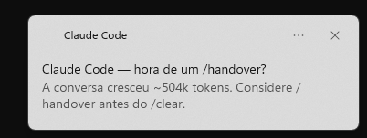
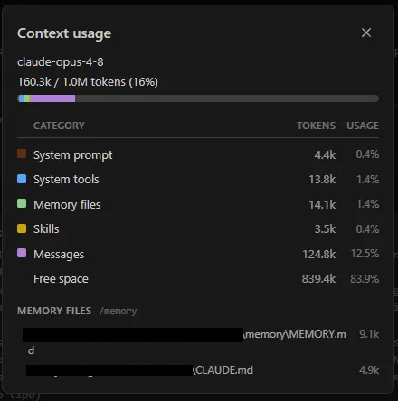
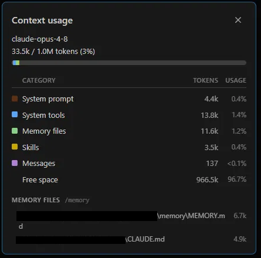
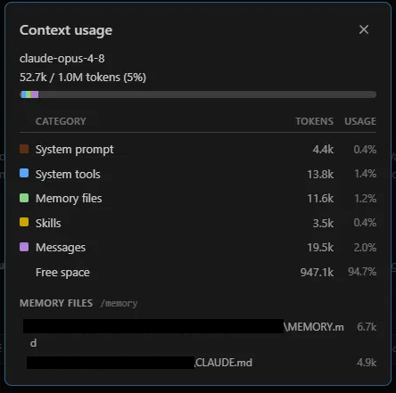
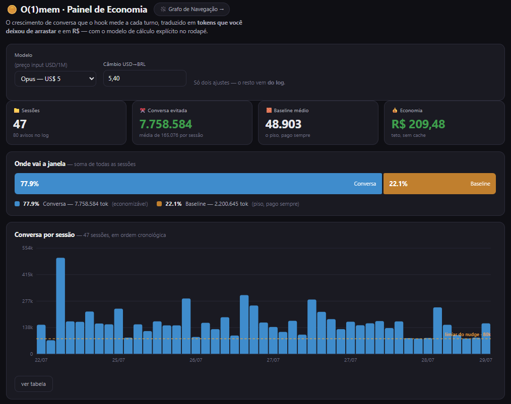

# 🪙 O(1)mem — Token Economy for Claude Code

### A cada nova sessão aberta após o `/clear`, você retoma o fio pelo índice — não re-paga a conversa arrastada
🇧🇷 Made in Brazil

---


<p align="center">
  
</p>

<p align="center"><sub><b>O(1)mem</b> — o nome é a tese: <code>O(1)</code> (com o <em>cap</em>, a memória cresce em tempo constante) + <code>mem</code> (memória). Simples por design.</sub></p>

---

## ⚡ TL;DR

> **Contexto é caro e finito. Estas skills param o vazamento, limpam o que já vazou, e atravessam o que sobrou quando o índice não basta.**

- `organizador-mem` — **enxuga** um arquivo de contexto grande (`CLAUDE.md`, memória) separando o que é sempre-relevante do que é sob-demanda.
- `handover` — **estanca** a perda de fio ao dar `/clear`, destilando a sessão em 3 camadas de custo + um cap que impede a memória de inflar de novo.
- `retomar` — **resolve qual projeto** retomar antes de ler qualquer memória, para quem trabalha em mais de um projeto ativo na mesma máquina.
- `handover-nudge-hook` — **avisa a hora** de dar o `/handover`, medindo o crescimento da conversa a cada turno (com trava de valor e rota de silêncio embutidas).
- `graph` — **atravessa por estrutura**: transforma os `[[wikilinks]]` que você já escreve em um grafo navegável (CLI + página). Não entra no boot.
- `rag` — **atravessa por significado**: busca semântica sobre o acervo frio (`MEMORY_ARCHIVE.md`, handovers), para quando ninguém escreveu o wikilink. Também não entra no boot.
- **instalador npm** (`@tbluhm82/o1mem`) — empacota Python + Node num só comando: detecta ambiente, indexa projetos, registra o hook.

👉 Uma faz a faxina. A outra impede que suje de novo. O hook avisa a hora. O grafo e o RAG atravessam o que já foi escrito. Juntos fecham o ciclo.

---

## 🔥 A dor (talvez você reconheça)

Toda sessão do Claude Code paga pedágio: reler os arquivos de instrução do projeto (`CLAUDE.md`, memória, handovers) — inteiros, sempre, mesmo quando 90% daquilo não toca a tarefa do dia. Eu vivi esse ciclo num projeto real, e essas skills nasceram dele. Cada uma ataca uma fatia do problema; as dores específicas estão na seção de cada uma.

> ⚠️ **Sobre os percentuais:** os números abaixo são **casos reais que eu observei**, não promessa. O ganho depende do tamanho do seu arquivo e de quanto dele é "sempre-relevante" versus "sob demanda". Trate como ordem de grandeza.

> 🌐 **Agnósticas de domínio.** Nasceram num projeto real meu, mas a mecânica serve qualquer repo com um arquivo de contexto grande demais ou uma memória que precisa sobreviver ao `/clear`. Os exemplos dentro de cada `SKILL.md` são só isso — exemplos.

---

## 🧹 `organizador-mem`

**A dor.** Meu `CLAUDE.md` tinha mais de 1500 linhas. Toda sessão lia tudo — mesmo quando 90% daquilo não tinha nada a ver com a tarefa do dia. Eu pagava, a cada turno, por regras de subsistemas que eu nem ia tocar.

**O que ela faz.** Separa o arquivo grande em **núcleo sempre-relevante** + **documentos-satélite sob demanda**, ligados por um *mapa* enxuto. O corte de cada pedaço é decidido por um **agente que lê e entende a semântica** — não é split cego por regex ou heading. Quando dois trechos parecem acoplados, ou uma seção cabe em dois tópicos, a skill **para e pergunta** antes de aplicar. Aprendi da pior forma que split mecânico fragmenta raciocínio ao meio.

**Por que melhora.** O modelo passa a ler o núcleo curto + o mapa, e só abre o satélite que a tarefa realmente toca. O custo de leitura deixa de ser "o arquivo todo" e vira "núcleo + o que importa agora".

**Quanto rendeu.**

| Antes | Depois | Redução |
|---|---|---|
| `CLAUDE.md` ~1589 linhas lidas/sessão | ~150 linhas de núcleo + mapa | **~90%** |

Faixa típica que eu esperaria: **60–90%**, quando a maior parte do arquivo é tópico-específica.

> ⚖️ **Leia esse `~90%` como teto, não média — e aqui está o porquê honesto.** Esta skill não *apaga* token pago (isso é o `handover`, abaixo); ela **difere** o custo: o satélite só é lido quando a tarefa o toca. O ganho por sessão vale `~90%` integral **só na sessão que não abre satélite nenhum**. Quando abre, você re-paga aquele satélite, e a economia real vira `Σ(1−pᵢ)·custo_satéliteᵢ − custo_do_mapa`, onde `pᵢ` é a taxa com que cada satélite é aberto. **No meu projeto eu medi `p≈0,50`** (cerca de metade das sessões abre ao menos um satélite de regra) — então a **média** fica materialmente abaixo do teto. Dois corolários: se `p` for alto, o ganho colapsa (você quase sempre paga o satélite mesmo); se você fatiar demais, o custo fixo do mapa pode comer a economia — por isso a skill **pergunta antes de cortar**. O que **não** depende de `p` é a *descoberta*: o mapa garante que você sempre sabe que a regra existe e onde está. Isso é ganho **qualitativo** (aderência), não de token — e é honestamente a metade mais valiosa.

**A intuição, em uma frase:** *nem toda regra é sempre relevante.* Princípios inegociáveis são núcleo — todo turno. A lei de um subsistema só importa quando você mexe nele. O mapa preserva a *descoberta* ("existe uma regra sobre X, abra tal doc") sem pagar o *conteúdo* até precisar.

**O que controla em `.claude/`.** Vive em `.claude/skills/organizador-mem/SKILL.md`. **Reorganiza** o seu `.claude/CLAUDE.md` (ou qualquer arquivo que você apontar) e cria a pasta de satélites ao lado (ex.: `documentacao/regras/`). Não toca em código — só na camada de instrução que o Claude carrega.

---

## 📤 `handover`

**A dor.** Tarefa pela metade e um dilema sem saída boa: carregar a conversa inteira pra frente (caríssimo) ou dar `/clear` e recomeçar reexplicando tudo (lento — e você SEMPRE esquece um porquê importante no caminho).

**O que ela faz.** Prepara a **saída limpa** da sessão. Escreve **um** documento seletivo em `documentacao/` — seletivo é regra, não adjetivo: só entra o que git + código + memória **não** contam sozinhos (o *porquê* das decisões com a alternativa descartada, o estado pendente, o próximo passo exato, os riscos). Atualiza um breadcrumb enxuto na memória e declara um **modo de retomada**: `rapida` (próximo passo não toca runtime) ou `verificada` (toca — e aí a sessão nova é obrigada a reconferir o estado vivo antes de afirmar qualquer coisa).

**Por que melhora.** Distribui o estado em **3 camadas de custo diferente**:

| Camada | Carrega quando | Custo |
|---|---|---|
| **Resume** | você retoma *esta* conversa | alto — e morre no `/clear` |
| **Memória-índice** | **toda** sessão nova | baixo — breadcrumb enxuto que aponta |
| **Handover-arquivo** | só quando alguém o abre | zero até ser aberto |

Cada informação fica na camada mais barata que ainda a entrega a tempo.

**Quanto rendeu.** O maior ganho é **estrutural** — e foi um bug meu que me ensinou. A 1ª versão preservava o histórico de retomadas para sempre: cada handover depositava uma linha permanente no índice, crescendo **O(n)** sem ninguém perceber. Esta versão traz um **cap de histórico** (no máximo as **2** retomadas anteriores; o resto delega aos ponteiros duráveis) → crescimento **O(1)**.

| Aspecto | Sem cap | Com cap |
|---|---|---|
| Índice de memória | 96 linhas e subindo | 65 linhas, estável (**redução de ~32%**) |
| Crescimento por sessão | +1 linha permanente (O(n)) | limitado (O(1)) |

Sem o cap, o índice voltaria a inflar em semanas — eu só descobri olhando o painel de context usage e me perguntando por que a memória pesava tanto.

> **Por que O(1), em uma respirada.** O cap troca uma **inclinação** por um **teto**. Sem ele, cada handover deposita uma linha que nunca sai — 10 sessões, 10 linhas; 100 sessões, 100 linhas: tamanho = `f(nº de sessões)`, cresce **para sempre (O(n))**. Com cap = 2, ao inserir a nova a mais antiga excedente é deletada — 10, 100 ou 1000 sessões → **sempre 2 linhas**. A variável `n` saiu da fórmula: não é "cresce devagar", é "não cresce" (**O(1)**). E isso importa mais que qualquer outra economia porque essa é a **única camada paga em toda sessão, para sempre** — o pior lugar do mundo para um acumulador morar.
>
> **O rigor que o nome do repo cobra.** O que é O(1) é o **histórico de RETOMADAs**, não o `MEMORY.md` inteiro: as linhas-índice que apontam para cada `project_*.md` ainda crescem uma por projeto. Sendo exato: **O(1) por sessão, O(p) por projetos** — e continua sendo a afirmação forte, porque sessão acontece centenas de vezes e projeto novo, meia dúzia. Por isso a precisão é *"crescimento do índice **por sessão**"*, não tempo de acesso.
>
> **E o que custou: nada.** As RETOMADAs antigas não sumiram — os `HANDOVER_*.md` em `documentacao/` são o registro permanente. O cap só tirou a cópia da camada cara (índice, paga sempre) e deixou na barata (arquivo, pago só quando aberto). Não foi `organizador-mem` disfarçado — foi mover de uma camada carregada para uma **diferida**. Economia real, não contábil.

**A intuição, em uma frase:** *a memória é o ÍNDICE — aponta, não repete.* A camada que carrega toda sessão tem que ser a mais enxuta possível: só precisa dizer **qual arquivo abrir** e **qual o próximo passo**. E como "o que era verdade quando escrevi" ≠ "o que é verdade agora", o modo `verificada` existe para uma coisa: economia de token **nunca** vale uma afirmação falsa sobre o runtime.

**O que controla em `.claude/`.** Vive em `.claude/skills/handover/SKILL.md`. **Escreve** o handover em `documentacao/` e **mantém** o índice de memória (`MEMORY.md` + `memory/*.md`) enxuto e capado. É a disciplina de *entrada* da memória; o `organizador-mem` é a *faxina*.

---

## 🧭 `retomar`

**A dor.** Quem trabalha em mais de um projeto ativo abre sessões ora com um diretório primário, ora com outro. O `MEMORY.md` que aparece sozinho no contexto é indexado pelo **diretório onde a sessão abriu** — não pela intenção de "o que eu quero retomar". Resultado: "retomar" puxa a memória do projeto errado, com toda a confiança do mundo, porque o conteúdo certo nem estava no contexto pra ser escolhido.

**O que ela faz.** Resolve **qual projeto** antes de ler memória, handover ou código. Enumera os projetos reais (não deduz slug por transformação de caminho), cruza contra o que o usuário nomeou — e se não nomeou e há mais de um projeto com breadcrumb de retomada, **pergunta**, nunca assume o diretório primário. Só depois de resolvido o projeto ela entrega ao **Passo 4** da skill `handover`, que decide *como* retomar (modo rápido ou verificado).

**Por que existe.** Ela cobre metade específica do problema: **qual** projeto, não **como** retomar. Existe porque retomar o projeto errado já é um erro recorrente e caro — uma pergunta custa segundos; retomar errado custa a sessão inteira.

**O que controla em `.claude/`.** Vive em `.claude/skills/retomar/SKILL.md`. Não escreve nada — só decide e delega.

---

## 🔗 Por que juntas

`handover` **alimenta** a memória a cada saída de sessão; `organizador-mem` a **reorganiza** quando ela incha; `retomar` garante que a sessão nova **carrega a memória certa** antes de tudo. Sem a primeira disciplinada (com o cap), a segunda vira **enxugar gelo** — cada handover deposita mais uma linha e o índice que você acabou de emagrecer engorda de novo. Juntas: entrada capada + faxina agêntica + resolução de projeto.

---

## ⏰ `handover-nudge-hook` — *quando* disparar

As skills acima resolvem o **como** estancar e limpar. Faltava o **quando** — e "quando" é justo o que a gente esquece no meio de uma tarefa boa. Este hook (`UserPromptSubmit`) mede o **crescimento da conversa** a cada turno e, ao cruzar um limiar, **sugere** um `/handover`.

O número que ele observa **não** é o total da janela — `system`, `tools`, `memória` e `skills` são ~fixos, não é isso que o handover economiza. Ele mede **`total_atual − baseline_da_sessão`**: o custo de re-pagar a *conversa* ao arrastá-la para frente. É esse delta que dispara.

<p align="center">
  
</p>

> O aviso chega como **toast nativo do sistema** (`notify_windows`, zero dependências) — você o vê mesmo de olho fora do terminal. Paridade nos dois runtimes (rótulo "Claude Code" ou "Hermes").

Duas travas o impedem de virar spam:

- **Trava de valor.** Ele não manda "abra um handover" — manda *aplicar o Passo 0 primeiro*. Exploração descartável sem estado durável recebe *"aqui basta memória"*, **nunca** um handover vazio com timestamp.
- **Rota de silêncio.** A oferta é um `AskUserQuestion` com *preparar / agora não / **silenciar nesta sessão***, sem repetir entre níveis — o antídoto da fadiga de alerta, que mataria o mecanismo.

Limiar **configurável** (default 80k — `n=1`, ordem de grandeza) e cada aviso vai pro log, pra você calibrar **com dado** em 10–15 sessões. Instalação e detalhes em [`handover-nudge-hook/`](handover-nudge-hook/).

**Enriquecimento opcional via `rag` (opt-in, desligado por padrão):** o hook pode consultar um daemon local (`rag/o1mem_rag_daemon.py`) para anexar ao aviso o trecho semanticamente mais próximo do que você está fazendo. Fica atrás de `rag_enrichment: false` no config — ninguém esbarra nisso sem ligar a chave manualmente.

---

## 🕸️ `graph` — atravessa por estrutura

O índice quente (`MEMORY.md`) resolve o boot. Mas quando o acervo cresce, às vezes você já tem uma pergunta e precisa **atravessar** — "o que mais toca essa regra?", "esse fato virou órfão?". O `graph` responde isso pela estrutura que você já escreve: os `[[wikilinks]]` que o `handover` te ensina a colocar em cada memória.

**Por que não é RAG.** No boot não existe query — só "retomar". Um retrieval precisaria recuperar algo antes de haver pergunta, trocando uma leitura determinística por uma probabilística que resolve o mesmo problema com chance de errar. O grafo não tem esse problema: as arestas **já existem**, custo de indexação ≈ zero (é parser, não embedding).

**O que ele expõe:**

| Comando | Para quê |
|---|---|
| `build` / `stats` | grava `graph.json`, mostra saúde do acervo |
| `neighbors <nome> -d 2` | vizinhança de um fato, profundidade configurável |
| `orphans` / `broken` | fatos que nada cita, ou wikilinks que não resolvem — nunca falha em silêncio |
| `cold --days 30` | candidatos a decay: quente, tipo `project`, sem nenhuma citação e velho — **sugere, quem move é humano** |

Tem também uma **UI autocontida** (`abrir_grafo.py`, zero CDN): tamanho do nó = quantas vezes é citado, arestas do índice desligadas por padrão (senão vira hairball), clique navega, busca destaca, chips filtram por tipo.

Não entra no boot — o `MEMORY.md` continua sendo a entrada O(1). Detalhes em [`graph/README.md`](graph/README.md).

---

## 🔎 `rag` — atravessa por significado

O grafo atravessa por quem cita quem. O `rag` atravessa por **significado** — *"qual fio fala disso?"*, mesmo quando ninguém escreveu o wikilink. As duas se somam: a query devolve os top-k semânticos **mais os vizinhos estruturais** de cada um.

**Onde ele ganha de verdade: o acervo FRIO.** O `MEMORY_ARCHIVE.md` nunca é carregado no boot — é exatamente onde a busca lexical falha ("em que sessão resolvemos aquilo?"). Cada bullet do archive vira um chunk; o índice quente fica fora do corpus (já está no contexto, indexá-lo duplicaria).

**Dado sempre fora do repo (regra dura).** O índice vetorial carrega texto integral da memória, que pode ser privado — e este repo é público. O Chroma persiste em `~/.claude/o1mem/chroma/<slug>/`, nunca dentro do worktree. Não é gitignore: o dado simplesmente nunca entra no repo.

```bash
pip install chromadb sentence-transformers   # opt-in, só esta skill precisa

python o1mem_rag.py index   --project X [--full] [--handovers DIR]
python o1mem_rag.py query   "custo do indice e decay" -k 3 [--json] [--no-graph]
python o1mem_rag.py stats
```

Indexação incremental por sha (reindexar sem mudança = 0 chunks re-embedados). Modelo default é multilíngue (`paraphrase-multilingual-MiniLM-L12-v2`) porque a memória é escrita em pt-BR. Também não entra no boot — é CLI offline, como o grafo. Detalhes em [`rag/README.md`](rag/README.md).

---

## 📦 Instalação via npm (`@tbluhm82/o1mem`)

O runtime que indexa e busca é Python — mas Node é o padrão portável de instalação entre sistemas. Um instalador único detecta Python, pede chave (se você quiser o modo aprendizado), instala dependências, **copia as skills (`organizador-mem`, `handover`, `retomar`) para o `.claude/skills/` do seu projeto**, indexa e registra o hook. Tudo num comando — o resumo final mostra o caminho exato de cada skill instalada.

```bash
npm install -g @tbluhm82/o1mem
o1mem install     # detecta Python/pip, escolhe modo, copia skills, indexa, registra o hook
o1mem status      # Python ok? Modo? Índices? Daemon?
o1mem query "sua pergunta" --project <slug-do-projeto>
```

| Modo | O que faz | Custo |
|---|---|---|
| **local** (padrão) | busca semântica pura (embeddings locais) | grátis |
| **aprendizado** | semântica + destilação: LLM lê top-3 e cura 1 parágrafo por pergunta | seus tokens |

Sem instalar via npm, dá pra usar direto do repo (`npm link`) — ver [`installer/README.md`](installer/README.md) para o passo a passo, os demais subcomandos (`index`, `config`, `uninstall`) e as garantias de segurança da chave (nunca logada, `chmod 600`, nunca em `config.json`).

---

## 📊 Evidência (uma sessão real)

O ciclo inteiro medido no painel *Context usage* do Claude Code — os três momentos de uma mesma tarefa (rodapés anonimizados de propósito):

<p align="center">
  
  
  
</p>

| | 1 · Sessão inchada | 2 · Depois do `/clear` | 3 · Depois da retomada |
|---|---|---|---|
| **Total da janela** | 160.3k | 33.5k | 52.7k |
| **`Messages` (a conversa)** | **124.8k** | 137 | **19.5k** |
| **`MEMORY.md` (índice)** | 9.1k | 6.7k | 6.7k |

**A manchete não é o total — é a conversa.** Retomar o fio custou **19.5k** de `Messages` contra os **124.8k** que a sessão inchada carregava: o estado voltou por **~16% do custo** de arrastar a conversa (**~84% de desconto**). Não é "economizei tokens" — é recuperar o estado de uma sessão de 124k **pagando 19k**.

**E o imposto permanente também caiu:** o índice de memória saiu de **9.1k → 6.7k** por sessão (−26%) e o *cap* o mantém estável — você não re-paga esse delta a cada `/clear`. Multiplicado pelas suas sessões, é o ganho composto do sistema.

> Números de **uma** sessão observada — ordem de grandeza, não promessa. É exatamente para transformar isto em calibragem que o `handover-nudge-hook` loga cada evento.

---

## 📈 `dashboard` — a evidência acima, mas da **sua** calibragem

A tabela ali de cima é de *uma* sessão minha. O painel em [`dashboard/`](dashboard/) transforma o seu próprio `handover-nudge.log` (JSONL que o hook grava a cada aviso) nesses mesmos números — sem preencher nada à mão.

<p align="center">
  
</p>

```bash
python dashboard/abrir_dashboard.py
```

O launcher acha os logs (`~/.claude/handover-nudge.log` e, se você roda no Hermes, `~/AppData/Local/hermes/handover-nudge.log`), embute os dados na página e abre no browser. Sem servidor, sem upload — `dashboard/index.html` também abre sozinho e aceita arrastar um log/CSV, para compartilhar.

O que ele mostra, direto do log:

- **Economia = `Messages`** (a conversa que você deixa de arrastar) por sessão — nunca um número inventado. O `baseline` (piso: system+tools+memória+CLAUDE.md) é o **custo de retomar**, pago dos dois jeitos, então **não** entra como economia.
- **Pizza "onde vai a janela"** — Messages vs. Fixo (na minha calibragem real, ≈ **89% / 11%**): a prova visual de que o que incha é a conversa, não o piso.
- **R$ (teto)** — usa o *pricing real da API* (Opus \$5 / Sonnet \$3 / Haiku \$1 / Fable \$10 por 1M), auto-detectado do campo `model`, com câmbio USD→BRL editável. Rotulado **teto** porque a re-leitura cai no cache (~0,1×).

> É a mesma honestidade do resto do repo: o painel só desenha o que o log tem. Sem log ainda? Rode algumas sessões com o hook ativo e ele se preenche.

---

## 🚀 Como usar

Duas formas de instalar — escolha pelo que você já tem no sistema:

| Você tem... | Use | Instala o quê |
|---|---|---|
| **Node** disponível | `npm install -g @tbluhm82/o1mem` (ver seção acima) | skills + hook + `rag`, num comando |
| **Só git** | clone + copiar pastas (abaixo) | só as skills; hook e `rag` são manuais |

```bash
git clone https://github.com/thiagobluhm/skills.git
cp -r skills/organizador-mem skills/handover skills/retomar <seu-projeto>/.claude/skills/
```

Se você trabalha em **mais de um projeto ativo** (sessões que abrem ora num, ora noutro), a skill `retomar` resolve **qual** projeto retomar antes de ler qualquer memória — sem ela, "retomar" tende a puxar a memória do diretório primário da sessão, não a do assunto que você quer continuar.

Cada `SKILL.md` é autocontido (frontmatter `name` + `description`). O Claude carrega a skill quando a tarefa casa com a `description`, ou quando você a chama pelo nome.

O ciclo de vida de uma sessão longa com o `handover` é sempre este:

| Você quer... | Comando | O que acontece |
|---|---|---|
| **Fechar a sessão sem perder o fio** | rode `/handover` | destila a tarefa em handover + memória e declara o modo de retomada |
| **Limpar o contexto** | `/clear` | zera esta conversa — o handover e a memória já estão em disco, nada se perde (só **você** executa; o modelo não pode) |
| **Retomar depois** | sessão NOVA → *"retomar o handover"* (ou `/retomar`) | a skill `retomar` resolve qual projeto, lê a linha `RETOMADA` do `MEMORY.md`, abre o handover indicado e segue o modo gravado |

👉 A regra de ouro: **`/clear` só depois do `/handover`**. O handover é o que torna o `/clear` seguro.

Estrutura do repositório:

```
o1mem/
├── handover/SKILL.md              # Claude Code (implementação de referência)
├── organizador-mem/SKILL.md       # Claude Code
├── retomar/SKILL.md               # Claude Code — resolve QUAL projeto antes de retomar (multi-projeto)
├── handover-nudge-hook/           # hook UserPromptSubmit (síncrono)
│   ├── handover_nudge.py
│   ├── handover-nudge.config.json
│   └── README.md
├── graph/                         # grafo de navegação da memória (não entra no boot)
│   ├── o1mem_graph.py             # backend/CLI: build, stats, neighbors, path, orphans, broken, cold
│   ├── abrir_grafo.py             # launcher: constrói e abre a UI já preenchida
│   ├── index.html                 # UI force-directed, autocontida (zero CDN)
│   ├── test_ui_smoke.js           # smoke headless da UI (node)
│   └── README.md
├── rag/                            # busca semântica sobre o acervo frio (não entra no boot)
│   ├── o1mem_rag.py                # CLI: index, query, stats
│   ├── o1mem_rag_daemon.py         # daemon HTTP local, para o hook consultar (opt-in)
│   ├── o1mem_distill.py            # destilação via LLM (modo aprendizado)
│   ├── test_rag_offline.py / test_daemon_offline.py
│   └── README.md
├── installer/                      # pacote npm publicado (@tbluhm82/o1mem)
│   ├── cli.js                      # entry point (bin: o1mem)
│   ├── package.json
│   ├── lib/                        # preflight, hooks, env, pip, prompt
│   └── README.md
├── dashboard/                       # painel HTML que lê o handover-nudge.log
│   ├── abrir_dashboard.py
│   └── index.html
├── adapters/
│   └── hermes/                    # porta para o Hermes Agent (async watchdog)
│       ├── README.md
│       ├── handover/SKILL.md
│       ├── organizador-mem/SKILL.md
│       └── nudge-watchdog/
└── PORTABILITY.md                 # mapeamento de ferramentas — fonte única
```

---

## 🔌 Roda em (sem lock-in)

O O(1)mem **não é do Claude Code** — é uma tese sobre onde o estado mora (índice barato sempre + arquivo caro sob demanda + teto O(1)). Isso independe de runtime.

| Runtime | Onde | Gatilho |
|---|---|---|
| **Claude Code** | raiz do repo (implementação de referência) | hook `UserPromptSubmit` — **síncrono**, instantâneo |
| **Hermes Agent** | [`adapters/hermes/`](adapters/hermes/) | cron watchdog — **assíncrono**, não bloqueia a conversa |

As skills são as **mesmas** — muda o vocabulário de ferramentas (`Write`→`write_file`, `AskUserQuestion`→`clarify`, `/clear`→`/reset`…) e, no gatilho, o modelo de execução. A tradução completa e o que um runtime novo precisa ter estão em **[`PORTABILITY.md`](PORTABILITY.md)**.

> A porta do Hermes traz uma **sacada e um preço honesto**: o watchdog async não bloqueia o caminho crítico (ganho), mas não é instantâneo e, com `deliver=local` no TUI, salva o aviso sem te notificar ativamente. Os trade-offs e as opções (disparar junto da compressão nativa, `deliver=telegram`, ou deixar manual) estão em [`adapters/hermes/README.md`](adapters/hermes/README.md) — nada varrido pra debaixo do tapete.

---

## 🤝 Testou? Me conta

Os percentuais daqui só valem o que valem porque vieram de caso real — e mais casos reais só melhoram a calibragem. Se rodar num projeto seu e os números baterem (ou **não** baterem), abre uma issue: o disclaimer lá de cima fica mais honesto a cada dado que chega.

Feito em Fortaleza. 🇧🇷
